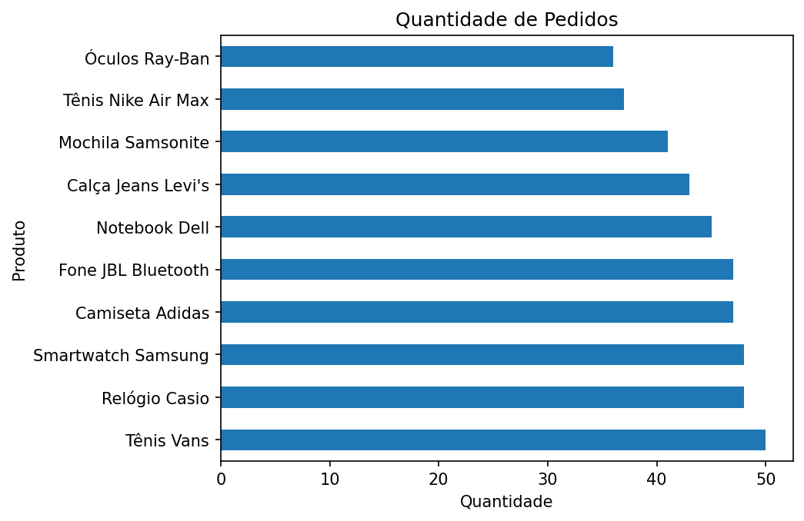
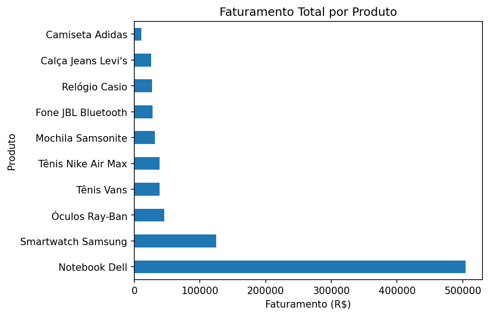
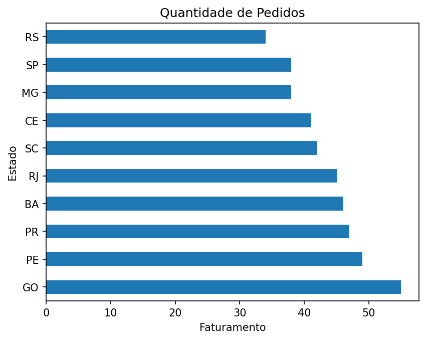
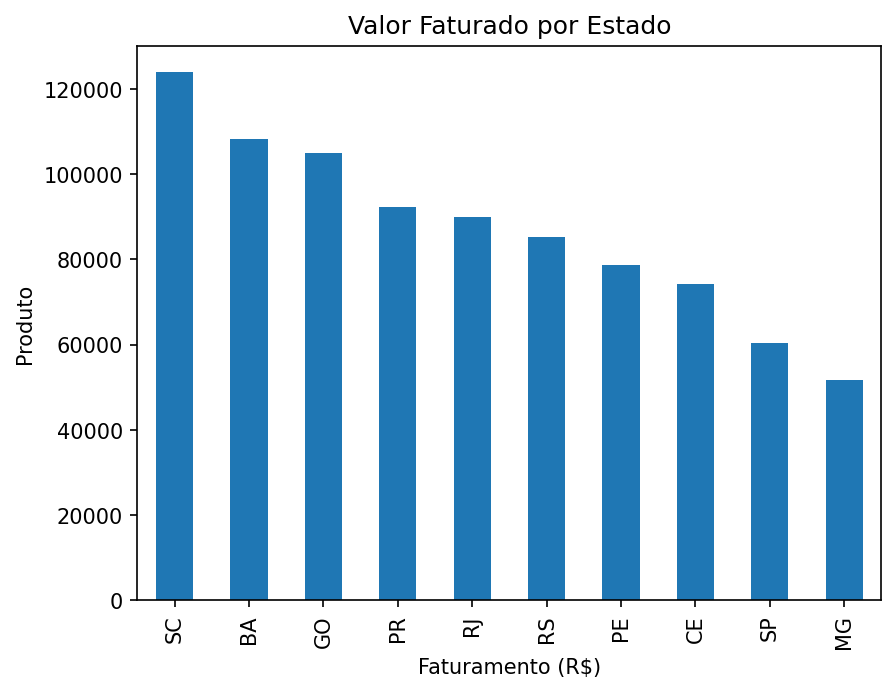
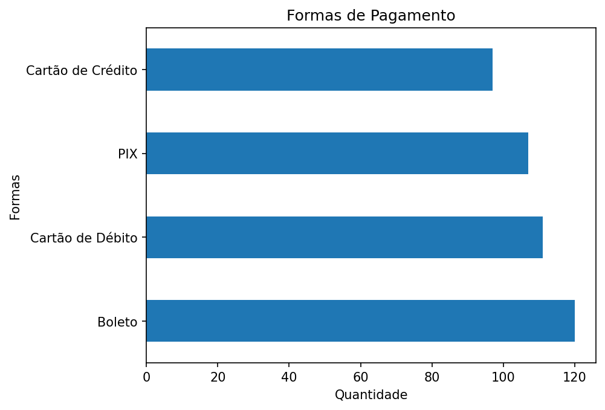
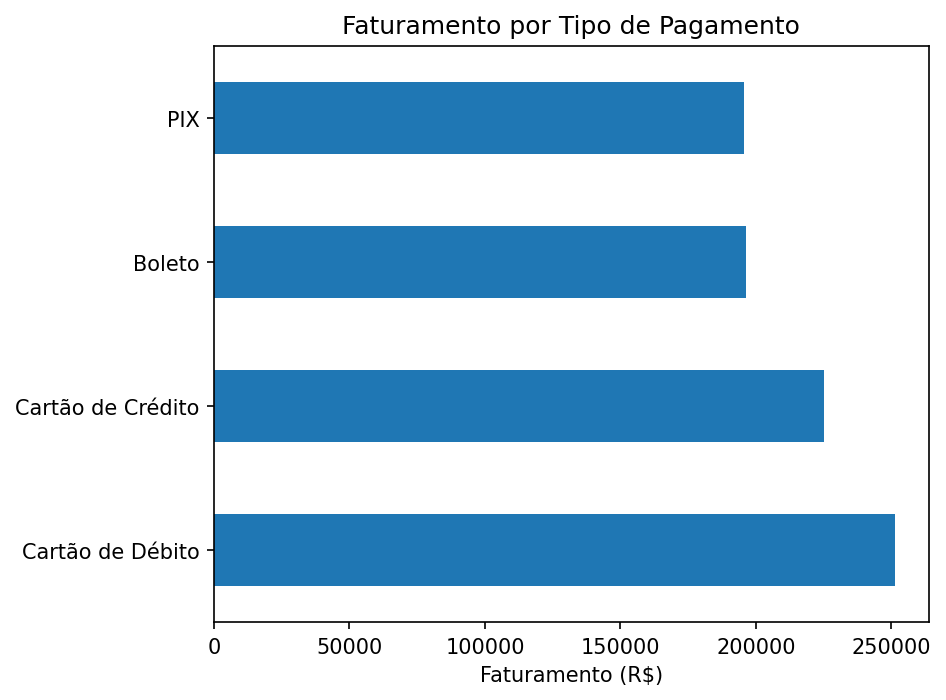

# 🛒 E-commerce — Limpeza e Análise de Dados

## Sobre o Projeto

Projeto desenvolvido para praticar limpeza, tratamento e análise exploratória de dados utilizando Python e pandas.

Neste projeto, analisei um dataset fictício de e-commerce contendo problemas comuns em bases reais, como dados nulos, registros duplicados, datas inconsistentes, valores inválidos e erros de cálculo.

Após o tratamento da base, realizei a exploração dos dados para gerar insights relevantes para o negócio, analisando faturamento, produtos mais vendidos, desempenho por estado e formas de pagamento.

-----

## 🎯 Objetivo do Projeto

O objetivo deste projeto foi simular um cenário real de análise de dados em um e-commerce, realizando desde a limpeza da base até a geração de insights e recomendações de negócio.

-----

## 📌 KPIs Principais

| Indicador | Valor |
|---|---|
| 💵 Faturamento Total | R$ 875.797,80 |
| 🏆 Produto com Maior Faturamento | Notebook Dell |
| 📦 Produto com Mais Pedidos | Tênis Vans |
| 📊 Produto com Maior Quantidade Vendida | Notebook Dell |
| 🗺️ Estado com Maior Faturamento | SC |
| 📍 Estado com Mais Pedidos | GO |

-----

## 🛠️ Ferramentas Utilizadas

- Python 3
- Pandas
- Matplotlib
- Jupyter Notebook

-----

## 🔍 Problemas Encontrados e Tratados

1. **Dados Nulos (cliente, estado, pagamento)** — Identificados e mantidos. Não havia como determinar o valor correto sem criar informações fictícias, o que distorceria a análise. Um cliente sem pagamento registrado, por exemplo, pode simplesmente não ter concluído a compra.

2. **Entregue sem Data de Entrega** — 12 pedidos com status “Entregue” apresentavam `data_entrega` nula. Mantidos e documentados, pois não há como saber a data real de entrega. Criar uma data fictícia seria um erro de análise.

3. **Dados Duplicados** — 9 linhas duplicadas encontradas e **removidas**. Linhas idênticas em cliente, produto, quantidade, valor e data representam registros inválidos.

4. **Formato de Data Inconsistente** — Datas misturavam os formatos `dd/mm/yyyy` e `yyyy-mm-dd`. Foram **corrigidas** e padronizadas para o formato `datetime`.

5. **Valores Impossíveis** — Pedidos com `valor_total` igual a R$ 0,00 ou negativo foram **removidos**. Um pedido sem valor financeiro não representa uma transação real e interfere diretamente no cálculo de faturamento.

6. **Erro de Cálculo** — Em 20 linhas, o resultado de `quantidade × valor_unitario` era diferente do `valor_total`. Esses registros foram **corrigidos** recalculando o valor total correto.

7. **Data de Entrega Anterior ao Pedido** — Registros em que a data de entrega era anterior à data do pedido foram **removidos**, pois representam uma inconsistência lógica.

-----

## 📊 Insights Gerados

### 🏆 Produtos — Quantidade de Pedidos



### 💰 Produtos — Faturamento Total



> **Insight:** O **Tênis Vans** foi o produto que apareceu em mais pedidos, enquanto o **Notebook Dell** liderou tanto em faturamento quanto em quantidade total vendida. Já o **Óculos Ray-Ban** teve menor volume de vendas, mas ficou entre os produtos com maior faturamento, indicando um perfil premium.

-----

### 🗺️ Estados — Quantidade de Pedidos



### 🗺️ Estados — Faturamento Total



> **Insight:** **GO** lidera em número de pedidos, mas ocupa apenas a 3ª posição em faturamento. **SC** apresenta o maior faturamento, mesmo ocupando apenas o 6º lugar em quantidade de pedidos, indicando um possível perfil de cliente premium.

-----

### 💳 Formas de Pagamento — Quantidade de Pedidos



### 💳 Formas de Pagamento — Faturamento Total



> **Insight:** **Boleto** é a forma de pagamento mais utilizada, mas apresenta uma das menores participações no faturamento. **Cartão de Débito** concentra o maior faturamento entre as formas de pagamento analisadas.

-----

## ✅ Conclusões e Recomendações

Com base na análise realizada, as seguintes ações são recomendadas para a empresa:

**1. Investigar estados com alto faturamento e baixa quantidade de pedidos**

Estados como SC apresentam ticket médio elevado, indicando clientes com maior poder de compra. Vale entender o perfil desse público e criar estratégias para aumentar o volume de pedidos nessas regiões.

**2. Criar campanhas para produtos premium**

O Óculos Ray-Ban é o produto menos vendido em quantidade, mas ocupa a 3ª posição em faturamento. Uma campanha direcionada para esse produto pode aumentar significativamente a receita sem depender apenas do aumento no volume de vendas.

**3. Analisar o comportamento dos usuários de Boleto**

O Boleto lidera em quantidade de uso, mas tem menor participação no faturamento total. Isso pode indicar que clientes que pagam por boleto tendem a comprar produtos de menor valor. Vale investigar se incentivos como desconto no PIX ou no cartão poderiam migrar parte desse público para formas de pagamento com maior faturamento.

-----

## ▶️ Como Executar

1. Instale o [VS Code](https://code.visualstudio.com/)
2. Instale o [Python](https://www.python.org/) e o Jupyter Notebook
3. Instale as dependências:

```bash
pip install pandas matplotlib
```

4. Execute o arquivo `limpeza.ipynb`
5. Execute o arquivo `analise_insights.ipynb`

-----

## 👤 Autor

**Matheus** — [github.com/matheuszuc](https://github.com/matheuszuc)
